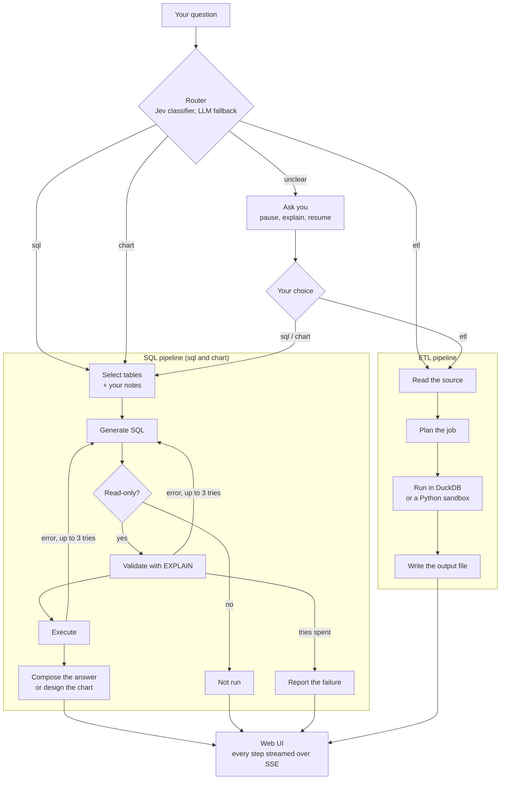

# OmniQuery

Ask questions about your own data in plain English, and see exactly how the answer was made.

## What

A local, single-user app that connects to a Postgres database or to CSV, Parquet and JSON files. Ask a question and you get the answer, plus the SQL that produced it, a result table or a chart. You can also ask it to extract or transform data into a new file.

## Why

- **Visible:** every step (routing, SQL, retries, which model answered) streams into the UI as it happens.
- **Safe:** it only reads. Queries that would change data are refused, both by a check and at the connection level.
- **Teachable:** add notes on tables and columns; they are sent with every query, and the answer shows which ones it used.
- **Cheap:** runs on free-tier models (Groq, Cloudflare Workers AI, Gemini), falling back to the next one when a limit is hit.

## For whom

Data engineers who want a quick look at a database or a set of files (what the tables hold, counts, trends) without writing SQL by hand, and who want to check the SQL that ran.

## How it works



The agents are [LangGraph](https://github.com/langchain-ai/langgraph) graphs (`backend/agents/`). The backend is FastAPI, uploaded files and outputs live in DuckDB, and the frontend is React + Vite + Tailwind with Vega-Lite charts.

## Quick start

Needs [uv](https://docs.astral.sh/uv/) and [Bun](https://bun.sh/).

```bash
cp backend/.env.example backend/.env    # add at least one model API key
cd frontend && bun install && bun run build
cd ../backend && uv run omniquery serve # opens http://127.0.0.1:7666
```

Then connect a database or upload files from the sidebar. There is also a CLI: `uv run omniquery --help`.

## Tests

```bash
cd backend && uv run pytest
cd frontend && bun run test
```
